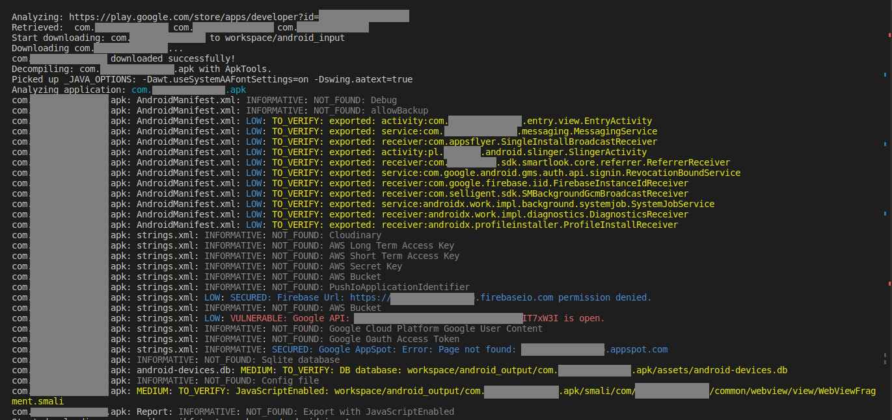

# Mobile Bounty Hunter


## General
Mobile Bounty Hunter is a script that downloads an app from the Google Play store, decompiles it and looks for secrets, API keys, misconfiguration.

As an user you can:
- update "*_store_urls_list.txt" file providing urls to application or developer profile
- update "*_application_package_name_list.txt" file providing application package names
- update "*_input" directory, where you put application to decompile and analyze
- update "*_output" directory, where you put decompiled application to analyze

All * in files/directories names are reference to "android" or "ios" as:
- "android_store_urls_list.txt"
- "ios_output"

The current analysis is:
- Android:
  - AndroidManifest.xml:
     - debug
     - allowBackup
     - exported: activities, receivers
  - /values/strings.xml:
     - Cloudinary key
     - AWS Long Term Access Key
     - AWS Short Term Access Key
     - AWS Secret Key
     - AWS Bucket
     - PushIoApplicationIdentifier
     - FirebaseUrl [Checking access with "/.json"]
     - Google API [Checking access by sending Google Maps request]
     - Google Clound Platform User Content
     - Google Oauth Access Token
     - Google AppSpot [Check if application is deployed]
   - Looking for files:
     - SQLite files [.sqlite]
     - DB files [.db]
     - Config files [*config*]
   - Looking into files:
     - JavaScriptEnabled
   - Post-Analyze:
     - Export activity with JavaScriptEnabled
- iOS:
  - Currently not supported.

## Example report


## How to run?
### Help
``` Bash
python3 MobileBountyHunter.py -h

usage: MobileBountyHunter.py [-h] [-ai] [-ao] [-al] [-as] [-ad {jadx,apktool}] [-ii] [-io] [-il] [-is] [-id]

options:
  -h, --help            show this help message and exit
  -ai, --analyze_android_input_directory
  -ao, --analyze_android_output_directory
  -al, --analyze_android_application_package_name_file
  -as, --analyze_android_store_list_file
  -ad {jadx,apktool}, --android_decompiling_tool {jadx,apktool}
  -ii, --analyze_ios_input_directory
  -io, --analyze_ios_output_directory
  -il, --analyze_ios_application_package_name_file
  -is, --analyze_ios_store_list_file
  -id, --ios_decompiling_tool
```

### Case 1: Run analyze using Google Play store
``` Bash
# 1. Update "android_store_urls_list.txt". For example:
https://play.google.com/store/apps/dev?id=5700313618786177705
https://play.google.com/store/apps/details?id=com.google.android.apps.chromecast.app
https://play.google.com/store/apps/details?id=com.google.android.apps.fitness

# 2. Run command:
python3 MobileBountyHunter.py -as
```

### Case 2: Run analyze using application package name
``` Bash
# 1. Update "android_application+package_name_list.txt". For example:
com.google.android.apps.chromecast.app
com.google.android.apps.youtube.kids
com.google.android.apps.fitness

# 2. Run command:
python3 MobileBountyHunter.py -al
```

### Case 3: Run analyze using input directory
``` Bash
# 1. In directory "android_input" move application. For example:
com.google.android.apps.youtube.kids.apk
com.google.android.apps.fitness.apk

# 2. Run command:
python3 MobileBountyHunter.py -ai
```

### Case 4: Run analyze using output directory
``` Bash
# 1. In directory "android_output" move decompiled application. For example:
com.google.android.apps.youtube.kids.apk
com.google.android.apps.fitness.apk

# 2. Run command:
python3 MobileBountyHunter.py -ao
```

## Why Mobile Bounty Hunter was created?
On the market you can find few great software to check mobile applications as:
- MobSF (https://github.com/MobSF/Mobile-Security-Framework-MobSF)
- ApkLeaks (https://github.com/dwisiswant0/apkleaks)
- Marianna Trench (https://github.com/facebook/mariana-trench)
- ApkUrlGrep (https://github.com/ndelphit/apkurlgrep)
- Qark (https://github.com/linkedin/qark)

The problem with some of above tools is that they are time-consuming. You need manually download the mobile application and run above tools against application. Mobile Bounty Hunter needs only link to Google Play / Apple Store (developer url, application url) and download all applications related to this URL automatically, decompiling and analyzing them.

### Example scenario
Let's assume that you are Bounty Hunter and you would like to search for security issues in mobile applications. You know that there are few companies to check:
- Company A - 20 applications in Google Play
- Company B - 30 applications in Google Play
- Company C - 10 applications in App Store

Now, you would like to find only basic issues (Low-hanging fruits as open Firebase or Google Api) to report them. Using Mobile Bounty Hunter, what you need to do is providing Companys URLs to Google Play/App Store. The Mobile Bounty Hunter automatically find all application that were published by these Companies, download them, decompile them, find the issues and report them to you (print in console and write the report).

Notice:
The Mobile Bounty Hunter is not full-penetration testing platform, it is rather "Low-hanging fruits" checker. If you want to scan whole application, please use MobSF (https://github.com/MobSF/Mobile-Security-Framework-MobSF).


## Disclaimer
The Mobile Bounty Hunter can be used ONLY for educational purpose and Bug Bounty activities to find the issues and report them to application developers. Any other activities (especially illegal) are forbidden.

## Todo's:
1. Check build configs like: local.properties, gradle.properties
2. Check: /data/misc/keystore/
3. Implement possibility to scan all files in decompiled application to find secrets
4. Implement generation of summary report where you can find information about finding and Bounty program report reference.

## Interesting links about Mobile Bug Bounty:
https://www.youtube.com/watch?v=OlgmPxTHLuY
https://hackmd.io/@Chal13W1zz/ABBH
https://www.youtube.com/watch?v=S6xGOU-QWWQ

Checking WebViews
https://medium.com/mobis3c/exploiting-android-webview-vulnerabilities-e2bcff780892


# Special Thanks!
- Banner: Jolanta Szczypara
(https://www.linkedin.com/in/jolanta-szczypara-2a6064278/)